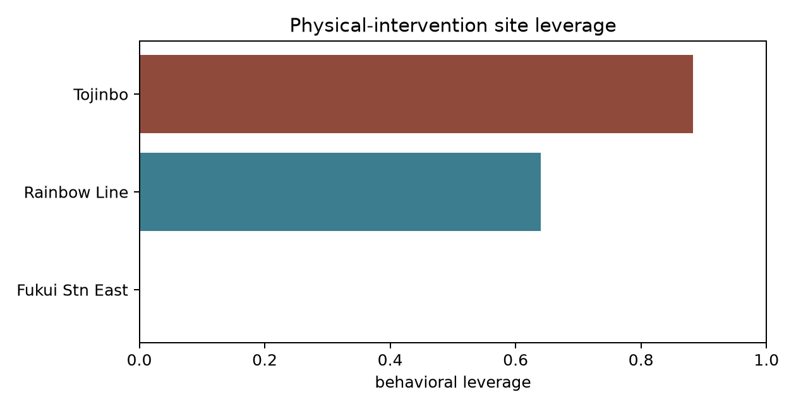

# Intervention-Site Opportunity Analysis

*Which Hokuriku hotspots, what physical change, and how large an effect it would need — computed from the built non-survey panel.*

Generated 2026-07-09. Evidence: `panel_site_daily.parquet`, `panel_area_daily.parquet`, `opportunity_signals.json`, `site_leverage.csv`. Companion: `reframe_physical_interventions.md`, `sem_nonsurvey_spec.md`.

Every number below is computed from real public data. Every *intervention* is a hypothesis; its effect size is a target for the SEM/simulation to bound and a future field trial to test, not a measured result.

---

## 1. Leverage ranking

A transparent, equal-weight composite over three observed drivers — peak concentration (95th-percentile day ÷ median), weekend/weekday footfall ratio, and the linked lodging market's weekend–weekday occupancy gap — each min-max normalized across the three camera sites:

| Rank | Site | Linked lodging | Peak/median | Weekend/weekday | Out-of-pref | Occ gap | **Leverage** |
|---|---|---|---|---|---|---|---|
| 1 | **Tojinbo** | Awara Onsen | 2.24 | 1.72 | — | 0.18 | **0.88** |
| 2 | **Rainbow Line** | Mikatagoko | 2.54 | 1.56 | 0.66 | 0.09 | **0.64** |
| 3 | Fukui Station East | Fukui Station | 1.67 | 1.42 | — | 0.02 | **0.00** |

The ranking is not a claim that Fukui Station has no opportunity — it has the broadest downstream reach as the rail gateway — but that its *flows are the least physically concentrated*, so a fixed physical change there acts on a flatter distribution.

## 2. Site 1 — Tojinbo (東尋坊): peak-day dispersal

**What the data shows.** Tojinbo footfall is the most peak-concentrated site: the 95th-percentile day carries 2.24× the median day's persons, weekends run 1.72× weekdays, and the busiest observed day reached 26,574 persons. The linked Awara Onsen lodging market carries an 18pp weekend–weekday occupancy gap with saturation on only 1.2% of days — so the surrounding beds are *not* full midweek. The bottleneck is temporal concentration of on-site load, not a shortage of capacity.

**Physical intervention hypotheses.**
- **Timed-entry / peak-hour signage** at the cliff approach to smooth intra-day load.
- **Midweek last-mile shuttle** from Awara Onsen / Awara-Yunomachi station, priced or scheduled to make a midweek Tojinbo trip frictionless.
- **Dynamic peak-day messaging** on the GBP profile and approach signage ("today is busy — Thursday is quiet").

**Effect it would need.** To convert the observed weekend surplus into midweek beds, a dispersal intervention would need to shift on the order of the 18pp occupancy gap — i.e. move a fraction of weekend footfall into weekdays large enough to raise midweek Awara occupancy from ~50% toward the ~68% weekend level. The SEM/simulation expresses this as a target elasticity on the friction→demand path; the webapp lets a partner set the assumed shift and read the propagated demand change.

**Why it's the top pick.** Highest leverage score, cliff geography physically channels flow (so a physical change has a real choke point to act on), and an existing AI camera already measures the outcome — a future trial has a ready-made instrument.

## 3. Site 2 — Rainbow Line (レインボーライン): car-access & parking

**What the data shows.** Rainbow Line is car-access dominated: 66% (lot 1) to 70% (lot 2) of license plates are out-of-prefecture, only ~10% are rental cars (so most are privately-owned vehicles driven in), and the dominant external origin is **Aichi** (Nagoya/Chubu) — not the Shinkansen-served Kanto corridor. Median throughput is ~145 vehicles/day at lot 1 with a peak/median of 2.54, the peakiest site of the three.

**Physical intervention hypotheses.**
- **Park-and-ride + EV shuttle** for peak days, converting a parking constraint into a managed flow.
- **Dynamic parking guidance** (lot-1 vs lot-2 balancing; the two gates already meter this).
- **Chubu-targeted routing / signage**, since the origin mix says the marginal visitor arrives by car from Aichi, not by rail.

**Effect it would need.** The intervention must relieve peak-day parking pressure without suppressing total visits; the target is redistribution across the two lots and across days rather than a headline volume increase. Because both gates are metered, lot-balancing effects are directly observable — a strong candidate for a measurable trial.

**Key reframe point.** This site demonstrates *why the physical-intervention lens matters*: a survey or a rail-centric analysis would miss that the binding lever here is **parking and road access**, because two-thirds of the demand never touches a train.

## 4. Site 3 — Fukui Station East (福井駅東口): wayfinding / dispersal

**What the data shows.** The rail gateway is the least peak-concentrated (peak/median 1.67, weekend/weekday 1.42) and its linked lodging market shows almost no weekend–weekday gap (2pp) — consistent with business + tourism mixed demand that is already relatively smooth.

**Physical intervention hypotheses.**
- **Wayfinding signage at the east exit** steering arrivals toward under-visited quarters (a classic choice-architecture nudge in physical space).
- **Digital-intent capture** — the station's GBP directions signal is the natural place to test whether map/routing presence shifts where people go next.

**Effect it would need.** Because flows are already smooth, the realistic target is *spatial* redistribution (which neighborhood) rather than *temporal*. Effect sizes here are expected to be smaller per the leverage score, so this site is positioned as a lower-priority, broad-reach option.

## 5. Cross-cutting demand signal (all lodging markets)

Google Business Profile "directions" requests co-move with realized stays in Awara (r = 0.59 same-week, decaying to 0.49 at +1 week and 0.34 at +2 weeks). This is the observed **intent→realized-demand channel** that (a) justifies an intent latent in the SEM and (b) gives any digital-facing component of a physical intervention (updated GBP hours, routing, peak messaging) a plausible, *measurable* demand pathway.

## 6. What this analysis explicitly does NOT claim

- It does **not** estimate a causal intervention effect. Leverage scores rank *opportunity*, not proven impact.
- It does **not** use the reservation panels for a Shinkansen DiD — those series begin Oct 2023 and have no seasonally-comparable pre-extension window (`opportunity_signals.json` → `S5`). The clean natural-experiment estimate lives in the thesis repo's multi-year series.
- Every effect-size statement is framed as *"the shift an intervention would need to produce"*, to be bounded by the SEM/simulation and tested by the pre-registered field trial (nudge-pilot app + power calc), not as an observed outcome.
