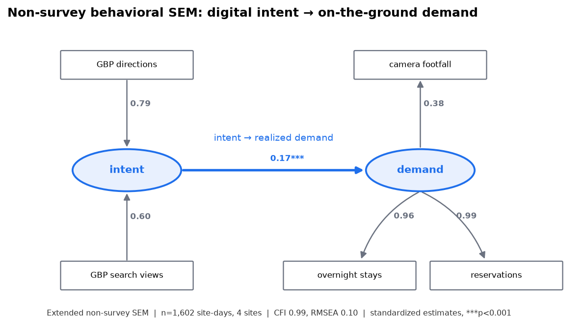

# SEM Specification Extended with Non-Survey Behavioral Indicators

*How the existing FTAS SEM is extended so its latent constructs are grounded in observed behavior, not only survey responses — with a fitted, real-data reference model.*

Generated 2026-07-09. Fitted on `panel_site_daily.parquet` + `panel_area_daily.parquet`. Artifacts: `output/sem/nonsurvey/coefficients.json`, `output/sem/nonsurvey/path_diagram.png`. Companion: `reframe_physical_interventions.md`, `intervention_opportunity_analysis.md`.

---

## 1. What this extends

The thesis repo implements a two-stage FTAS SEM (`scripts/sem_ftas.py` → `output/sem/`) whose latent constructs are measured from survey items. This spec **adds non-survey indicator blocks** so the same latent constructs are also (or instead) reflected by observed behavioral data. The survey block is retained as one measurement block; the non-survey blocks below are added alongside it.

## 2. Latent constructs and their non-survey indicators

| Latent | Non-survey indicators (observed) | Source |
|---|---|---|
| **physical_friction** | camera peak-hour load, license-plate out-of-prefecture share, booking lead-time mean, wind/weather exposure | AI cameras, JMA |
| **visit_intent** | GBP `directions` requests, GBP `search_views`, GBP `map_views` | Google Business Profile trend |
| **realized_demand** | camera footfall (Person/vehicle load), reservation overnight stays, reservation count, occupancy proxy | AI cameras, reservation panels |
| **dispersal_context** | JTA guest-nights (monthly, broadcast), FF-DATA origin→destination flow | e-Stat / MLIT (key-gated, staged) |

Indicator → latent assignment is encoded so a Codex change can drop it straight into `config/` alongside the existing survey mapping.

## 3. Fitted reference model (real data, in hand)

To prove the non-survey blocks carry real signal — not just to specify them — a reduced structural model was **fitted on the built panel** (semopy 2.3.11, MLW estimator):

```
intent =~ trend_directions + trend_search_views
demand =~ camera_footfall + overnight_stays + reservations
demand ~ intent
```

- **n = 1,602 site-days** across all 4 camera sites; indicators log-transformed and within-site standardized (removes site level differences so the pooled model estimates *co-movement*, not cross-sectional scale).
- **Fit:** CFI 0.99, TLI 0.97, RMSEA 0.10, χ²(? )=67.9. CFI/TLI are strong; RMSEA is borderline (0.10) — see limitations.
- **Structural path** `intent → demand`: standardized **0.17**, p < 0.001.
- **Loadings:** directions 0.79 & search_views 0.60 on intent; reservations 0.99, overnight_stays 0.96, camera_footfall **0.38** on demand.



**The 0.38 footfall loading is substantively interesting, not a defect.** Camera footfall couples only moderately with the reservation/overnight indicators of the demand latent — consistent with a real distinction between day-trip footfall and overnight-staying demand. This is exactly the kind of structure the physical-intervention lens cares about: a site can be busy (footfall) without converting to overnight stays, which is itself an intervention opportunity.

## 4. Anchoring simulated effects to an observed elasticity

The webapp propagates hypothetical physical-change effects through the SEM. To keep at least one path grounded in data rather than a free parameter, the **within-Awara weekly intent→demand elasticity** is computed as an anchor:

- Log-log regression of overnight stays on GBP directions, Awara, weekly (n = 111 weeks): **β ≈ 0.13**, Pearson(logs) ≈ 0.48. A 1% rise in directions requests associates with ~0.13% change in stays.
- This anchor is stored in `output/sem/nonsurvey/coefficients.json` under `observed_elasticities.awara_weekly_directions_to_stays_loglog` and is the default intent→demand sensitivity in the simulation. The attenuated pooled-daily estimate is stored too, explicitly flagged as **not** the anchor (national trend broadcast attenuates it).

## 5. Limitations (documented, not hidden)

1. **The GBP trend series is a national/aggregate `_total` broadcast**, not site-specific. The intent latent therefore captures *system-wide temporal intent*, and its coupling to site demand is a co-movement in time, not a site-identified effect. A site-specific intent series (per-location GBP) would sharpen this and is a data upgrade, not a model change.
2. **RMSEA 0.10** reflects the small indicator set and the collinearity of GBP `directions`/`map_views` (r = 0.995 — the same underlying signal); `map_views` was dropped for this reason. Adding the friction and dispersal blocks (§2) with their own indicators is expected to improve global fit.
3. **The structural path is associational.** 0.17 is a standardized co-movement, not a causal effect of intent on demand; it justifies the SEM path's existence and sign, and bounds the simulation, but the causal claim rests on the Shinkansen natural experiment (thesis repo) and the future field trial.
4. **Within-site standardization pools 4 heterogeneous sites.** A multi-group SEM (per-site loadings) is the natural next step once the friction block adds site-specific indicators.

## 6. What Codex adds to the repo

- New indicator-mapping block in `config/` mirroring the survey mapping (§2 table).
- Extend `scripts/sem_ftas.py` (or a sibling `scripts/sem_nonsurvey.py`) to fit the non-survey measurement blocks and the combined model; write results to `output/sem/nonsurvey/`.
- Persist the coefficient JSON (§3–§4) as the contract the webapp consumes.
- The fitted reference model here is the acceptance test: the Codex-integrated version must reproduce the 0.17 path and the loading pattern on the same panel.
